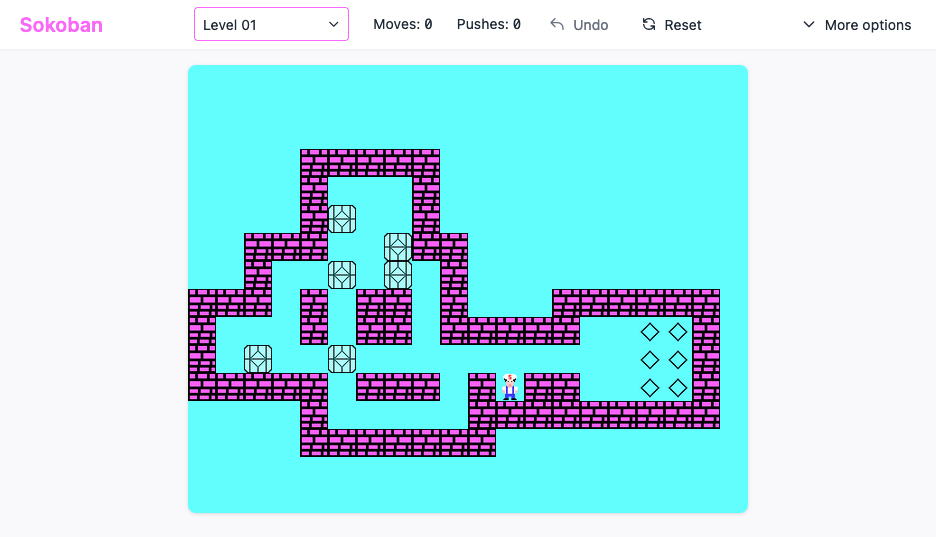

# Sokoban

This project is a clone of the popular puzzle game [Sokoban](https://de.wikipedia.org/wiki/Sokoban).

The project consists of a plain Kotlin `core` library containing the game logic and bundled levels, as well as a
`web` module that uses the `core` library to create a web app using the [fritz2](https://fritz2.dev) framework.

Additionally, there is a `legacy` module that contains a legacy Java app using Swing. This is a rewrite of the original
version that I wrote back in school. It has been refactored to use the new `core` library as well.

The latest snapshot version can be played [here](https://sokoban.haukesomm.de).

## Screenshot

## Modules

| Module   | Description                                                                                                                                                       |
|----------|-------------------------------------------------------------------------------------------------------------------------------------------------------------------|
| `core`   | Core library written in Kotlin containing the actual game logic and bundled levels.                                                                               |
| `web`    | Web app written in Kotlin using the [fritz2](https://fritz2.dev) framework. It is based on the `core` library. This is the actual game that can be played online. |
| `legacy` | Legacy Java app using Swing. Back in school, the original version was one of my first coding projects. Has been rewritten to use the new `core` library as well.  |

> Please note: Even though the core module is used by the legacy Java code, it is intended to be used in Kotlin
> projects only and is not fully compatible with Java!